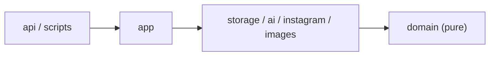
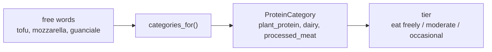

# Dispensa browse filters: a plan for Cursor

## The problem in one sentence

Browse works, but filtering is thin, the card badge shows a random field, and about
45% of the cards are not real recipes, so the page feels noisy and hard to steer.

Claude Design gave us a clear target for the fix: direction **1a, the "Quiet Command
Bar"**. One search line at rest, everything else on demand. This plan turns that picture
into small, safe steps for Cursor.

The wider name for what we are building is **faceted search**: let the user filter a
collection by a few known dimensions at once (protein, dish, cuisine, time), plus a
text search. It is a well understood pattern, so we are not inventing anything new.

**One honest warning up front.** The mockup is beautiful, and parts of it are drawn on
data we do not have yet. The pretty Italian badges (Frittata, Contorno) and the one-line
card descriptions have no field behind them in the code. The ingredient dropdown with
counts ("tofu 31") needs an index and clean ingredient names we have not built. So this
plan does the backend first, ships a working version, and keeps the missing-data features
as a separate step at the end. That way you never hit a wall halfway.

---

## How to use this with Cursor

- Do **one session at a time**. Each one below is a full, small unit of work.
- After each session, run the full green gate before moving on:
  `ruff check --fix`, `ruff format`, `mypy`, `pytest`, `lint-imports`.
  The frontend is vanilla JS, so there is no `tsc` step.
- **Read the protein mapping table by eye.** That table is a real-world decision (is tofu
  a legume? is guanciale processed?), not a mechanical one. Do not accept the AI grouping
  on faith. This is the one place to slow down.

### Which screenshots to attach

Attach only the four that show direction **1a** and the design rules. The others are the
rejected directions and will confuse Cursor.

| File | What it is | Give to Cursor? |
| --- | --- | --- |
| `Dispensa_Filter_Explorations.png` | 1a desktop, calm default | Yes |
| `Dispensa_Filter_Explorations__5_.png` | 1a desktop, Filters panel open | Yes |
| `Dispensa_Filter_Explorations__4_.png` | 1a mobile, calm + bottom sheet | Yes |
| `Dispensa_Filter_Explorations__3_.png` | The three design rules (is-recipe, 8 pills, badge) | Yes |
| `Dispensa_Filter_Explorations__1_.png` | 1c, a direction we are NOT building | No |
| `Dispensa_Filter_Explorations__2_.png` | 1b and 1c, directions we are NOT building | No |

---

## Ground rules (the architecture we already have)

We keep the layered design and its dependency rule. In plain words: inner layers never
import outer ones. New pure logic goes to the centre (`domain`), filtering stays in
storage, the API only wires request parameters to the store.



Where the new work lands:

- The protein categories and their mapping are pure rules, so they live in `domain`.
- The new filters live in `repository.find` (`foodiegram/repository.py`), next to the ones
  already there.
- `api.list_recipes` (`foodiegram/api.py`) only reads new query parameters and passes them
  down.
- The UI lives in `public/` (served as static files by the API).

Conventions to keep (from `CLAUDE.md`):

- Keyword-only arguments on functions with more than one parameter.
- Use-cases are module-level functions, never classes.
- Pydantic v2, frozen models. `mypy` strict. No `**kwargs`, explicit signatures.
- No `from __future__ import annotations` (we target Python 3.14).
- Errors carry detail as attributes, not inside the message string.
- IDs are strings. Recipes are keyed by the Instagram shortcode (`code`).

**Out of scope for this plan.** The mockup header shows a "This Week / Plan" navigation.
That is the weekly meal planner, a different phase. Keep the current "Browse / Favourites"
navigation. Do not build the planner here.

---

## The shared decision: one name for protein (do this before the filter)

Today `Recipe.proteins` is a free list of words: `["tofu"]`, `["chicken", "cheese"]`, and
so on. The mockup filters by eight fixed categories in three Mediterranean tiers. Those two
things do not line up. Nothing in the code turns "tofu" into a category.

So we add one shared name for a protein group, used by the filter now and by the weekly
balance panel later. In DDD terms this is **ubiquitous language**: one word for a thing,
the same everywhere in the app. If the filter and the balance panel invent their own
groupings, they will disagree on the same screen.

The shape of the mapping:



The eight categories, their tier, and the words that map to each:

| Category | Tier | Words that map here |
| --- | --- | --- |
| fish | eat freely | fish, seafood, salmon, tuna, shrimp, cod |
| legumes | eat freely | beans, chickpeas, ceci, lentils, peas |
| plant_protein | eat freely | tofu, tempeh, edamame, seitan, soy |
| poultry | moderate | chicken, turkey |
| eggs | moderate | eggs |
| dairy | moderate | cheese, mozzarella, ricotta, yogurt, milk, parmesan |
| red_meat | occasional | beef, pork, lamb, veal |
| processed_meat | occasional | salame, prosciutto, pancetta, guanciale, wurstel, bacon, speck |

Two honest gaps to accept now, so nobody is surprised later:

- **Processed meat has no source in extraction yet.** The extraction prompt never emits
  cured-meat words, so the "Processed" facet will match almost nothing until the
  re-extraction step at the end. Your carbonara rule (guanciale counts as processed) needs
  that step to have any data.
- **Plant coverage is partial.** "tofu" is already tagged, so the Plant facet works today.
  "seitan" and "tempeh" may not be tagged until re-extraction.

One more rule: **nuts are not a protein category.** In the Mediterranean frame they are a
fats and snacks group, not a weekly protein target. Tag them if you like, but keep them out
of the balance. This keeps the legume and plant numbers honest.

---

## Build order

Backend first, then the one big frontend session, then the data work.

```
1. is_recipe filter + counts        (small, visible win)
2. ProteinCategory + mapping         (pure domain, tested)
3. protein facet filter              (repo + API)
4. multi-ingredient search (chips)   (repo + API)
5. the Quiet Command Bar UI          (the big frontend session)
--- later, needs new data ---
6. ingredient index + autocomplete   (needs clean names)
7. re-extraction batch               (summary, plant + processed words, course)
```

---

## Session 1: the "is this a recipe" filter and counts

**Why first.** The `is_recipe` flag already exists on `Recipe` and the extraction already
sets it well. We just never let anyone filter on it, and we never show a total. This is the
smallest change with the biggest cleanup: about half the noise leaves the page.

**Backend.**

- In `repository.find`, add a keyword-only `is_recipe: bool | None = None` and filter like
  the others (`if is_recipe is not None: keep r where r.is_recipe == is_recipe`).
- Add a count endpoint the segmented control can read. `GET /recipes/count` takes the same
  filter parameters as `/recipes` and returns both segment totals under the current facets:

  ```json
  { "recipes_only": 634, "all_saves": 1152 }
  ```

  where `recipes_only = len(find(is_recipe=True, ...other filters))` and
  `all_saves = len(find(is_recipe=None, ...other filters))`. Keep the `/recipes` list
  response shape the same, so the frontend contract does not break.
- In `api.list_recipes`, add the `is_recipe` query parameter (default `None`).

**Frontend (`public/`).**

- A two-option segmented control by the results count: "Recipes only" (default) and
  "All saves · N". Toggling sets `is_recipe` and refetches. On mobile it is a full-width
  two-segment switch (see rule card in `__3_`).
- The count line reads "Showing 50 of {active segment total}".

**Acceptance.**

- Default browse shows only real recipes.
- The toggle flips to all saves and back, and the counts match.
- Keyboard reaches the toggle, focus is visible, and the text passes WCAG AA contrast.

**Note on cost.** The repo reads every JSON file on each call, and now the page loads do
one list plus one count call. At ~1,150 small files this is milliseconds, so it is fine. If
it ever hurts, cache `list_all` or move the store to SQLModel. Not now.

---

## Session 2: ProteinCategory and the mapping (pure, tested)

**Goal.** Add the shared name from the section above. No UI in this session.

- Add `ProteinCategory` as a `StrEnum` in `foodiegram/domain/enums.py` with the eight
  members: `fish, legumes, poultry, eggs, dairy, red_meat, processed_meat, plant_protein`.
- Add a small module `foodiegram/domain/proteins.py` with:
  - a mapping dict from word to `ProteinCategory` (the table above, lower-cased keys),
  - `categories_for(proteins: list[str]) -> set[ProteinCategory]`, a module-level function
    that maps each word and returns the set (unknown words are skipped, never an error),
  - the tier grouping, either a `TIERS` constant or `tier_for(category) -> Tier`, so the
    balance panel can reuse the exact same grouping later.

**Acceptance (unit tests).**

- `tofu` maps to `plant_protein`, `mozzarella` and `ricotta` to `dairy`, `chicken` to
  `poultry`, `beef` and `pork` to `red_meat`, `guanciale` and `prosciutto` to
  `processed_meat`, `ceci` and `lenticchie` to `legumes`.
- An unknown word returns an empty set, and does not raise.

This is the file to read by eye before you accept it.

---

## Session 3: the protein facet filter (repo + API)

- In `repository.find`, add `protein_categories: list[ProteinCategory] | None = None`.
  ANY-match: a recipe passes if
  `categories_for(r.proteins) & set(protein_categories)` is not empty.
- In `api.list_recipes`, add a repeatable `protein_category` query parameter. Coerce each
  value with the existing `_to_enum` helper and ignore invalid ones.

**Acceptance.**

- `/recipes?protein_category=plant_protein` returns tofu recipes.
- Two categories OR together (`?protein_category=fish&protein_category=legumes`).
- An unknown value is ignored, not a 500. Processed returns few or none today (expected).

---

## Session 4: multi-ingredient search, the chips (repo + API)

The search box holds several ingredient chips at once, for example `zucca` and `tofu`
together (see `__5_`). Today `find(q=...)` takes one string only.

- In `repository.find`, add `ingredients: list[str] | None = None` with **AND-match**: the
  recipe must match every term. Each term is expanded by `synonyms.expand_term` and matched
  against title, caption, and the ingredient list, the same way `q` already works. Keep `q`
  for free single-text search.
- In `synonyms.py`, add the missing `zucca` group. Keep it separate from `zucchine`, they
  are different vegetables:
  `frozenset({"zucca", "pumpkin", "squash", "butternut"})`.
- In `api.list_recipes`, accept a repeatable `ingredient` parameter and pass it as the
  `ingredients` list.

**Acceptance.**

- `?ingredient=zucca&ingredient=tofu` returns only recipes that match both.
- `zucca` now finds `pumpkin` and `squash` too.

The dropdown of suggestions with counts ("tofu 31") is **not** this session. That needs an
ingredient index and clean names, which is Session 6 (later). The chip filter works fine
without it.

---

## Session 5: the Quiet Command Bar (the big frontend session)

This builds direction 1a from `__6_` (calm), `__5_` (open panel), and `__4_` (mobile). It
touches only `public/`. The backend from sessions 1 to 4 is already in place.

**At rest, keep it calm.** This is the whole point of 1a.

```
[  search by ingredient: zucchine, ceci, tofu...      ]  [ Filters > ]

Showing 50 of 634 recipes            [ Recipes only | All saves · 1,152 ]

[ card ] [ card ] [ card ] ...
```

Nothing else is visible at rest: search line, Filters button, the is-recipe segmented
control (from Session 1), the count line, the card grid.

**The search line** holds removable ingredient chips once the user adds ingredients, and
sends them as `ingredient=` parameters (Session 4). Free text is still allowed.

**The Filters button** opens the panel. On desktop it expands below the bar. On mobile it
is a bottom sheet (see `__4_`). The panel holds:

- **Protein, in three tiers.** Eat freely: Fish, Legumes, Plant protein. Moderate: Poultry,
  Eggs, Dairy. Occasional: Red meat, Processed. Each pill is a **colour dot plus a text
  label, always together, never colour alone** (accessibility rule from `__3_`). Selecting
  pills sends `protein_category=` (Session 3). Multi-select, OR within protein.
- **Secondary dropdowns:** Dish type, Meal, Cuisine, Difficulty, Dietary. Each defaults to
  "Any" and wires to the existing parameters (`dish_type`, `meal_type`, `cuisine`,
  `difficulty`, `dietary_tag`).
- **Cook time is not supported yet.** There is no time parameter in the API. For this first
  version, leave Cook time out. Adding a `max_time` parameter can be a small follow-up.
- **"Clear all"** and a primary **"Show N recipes"** button, where N updates live from the
  count endpoint. The Filters button shows a small count of active filters ("Filters ▾ 1").

**Fix the card badge.** Show `dish_type` only, and show nothing when it is `unknown`. Never
fall back to cuisine or "Other". That fallback is exactly why the badge looked random.
(The pretty Italian labels like Frittata and Contorno need a `course` field we do not have.
That is the re-extraction step, not this session. Empty beats wrong.)

**Fix the contrast.** The pale tan mono labels on cream (the count line and the card meta
line) are the one thing at risk of failing WCAG AA for small text. Darken them so normal
text reaches a contrast ratio of at least 4.5:1 against the cream background. Check the real
hex values, do not guess.

**Acceptance.**

- The resting state shows only the search line, Filters, the segmented control, the count,
  and the grid.
- Opening Filters reveals the three protein tiers and the secondary dropdowns.
- Selecting facets or chips refetches, and both the count line and the "Show N" button
  update.
- The badge shows a dish or nothing, never cuisine or "Other".
- Small labels pass AA contrast, every control is reachable by keyboard, and the mobile
  bottom sheet opens and closes.

**If momentum stalls, split this session.** First the resting state plus the is-recipe
segmented plus the card badge fix, which is visible fast. Then the Filters panel (tiers and
secondary dropdowns) as a second sitting. Smallest restart wins.

---

## Later, once the basics ship (needs new data, do not start now)

### Session 6: ingredient index and autocomplete with counts

The dropdown "tofu 31 / toffarella 4" (`__5_`) needs two things we do not have: an endpoint
that lists distinct ingredients with recipe counts, and clean ingredient names.

The name for the second part is **canonicalization**, a form of entity linking: map the many
spellings and languages of one food to a single name. "toffarella" sitting next to "tofu" is
the messy vocabulary leaking through, which is the proof that the cleaning has to come first.

Our earlier decision holds: let the model do the cleaning at extraction time (it already
knows that `zucca` is squash and `seitan` is wheat gluten), and keep `synonyms.py` as a
small safety net for false friends and known errors. Then build the index from the verbatim
ingredient lists and expose `GET /ingredients?prefix=tof` returning `[{name, count}]`.

Do not start this before Session 5 ships. The chip filter is useful without it.

### Session 7: the re-extraction batch

To fill the gaps the mockup assumes, the extraction prompt and schema need:

- a short `summary` field, the one-line card description,
- plant-protein words (`tofu` is there, add `tempeh`, `edamame`, `seitan`, `soy`),
- processed and cured-meat detection (`salame`, `prosciutto`, `pancetta`, `guanciale`,
  `wurstel`, `bacon`, `speck`), so the Processed facet and the carbonara rule have data,
- optional: a `course` field for the pretty Italian badges (Frittata, Secondo, Contorno).

This is a prompt and `scripts` change plus a batch run you drive yourself (Batch API,
`gpt-5.4-mini`, low reasoning effort, no temperature). It rewrites data, so it goes through
the append-only extractions and `promote()` flow, and it must not overwrite user edits.
Good news: `repository.save` already protects favourites and notes on re-extraction.

Sequence this last, after the categories prove right in the real UI.

---

## Further reading and related code

Related code to open while working:

- `foodiegram/repository.py`: `find`, `list_all`, `save` (the store and its filters).
- `foodiegram/api.py`: `list_recipes` (where query parameters are wired).
- `foodiegram/domain/enums.py` and `foodiegram/domain/models.py`: the taxonomy and `Recipe`.
- `foodiegram/api_models.py`: `RecipeSummary` (what each card receives).
- `foodiegram/domain/synonyms.py`: `expand_term` (cross-language search).
- `public/index.html` and its JS: the frontend.
- `CLAUDE.md`: the coding conventions this plan follows.

The ideas behind the plan:

- Faceted search: filter a set by a few known dimensions at once. A common, well documented
  UI pattern.
- Ubiquitous language and the dependency rule: Eric Evans, *Domain-Driven Design*, and
  Robert C. Martin, *Clean Architecture*. One shared name, inner layers stay pure.
- Entity linking and canonicalization: mapping many surface forms of a thing to one
  canonical name. This is why ingredient cleaning belongs at extraction, not in a growing
  hand-written dictionary.
